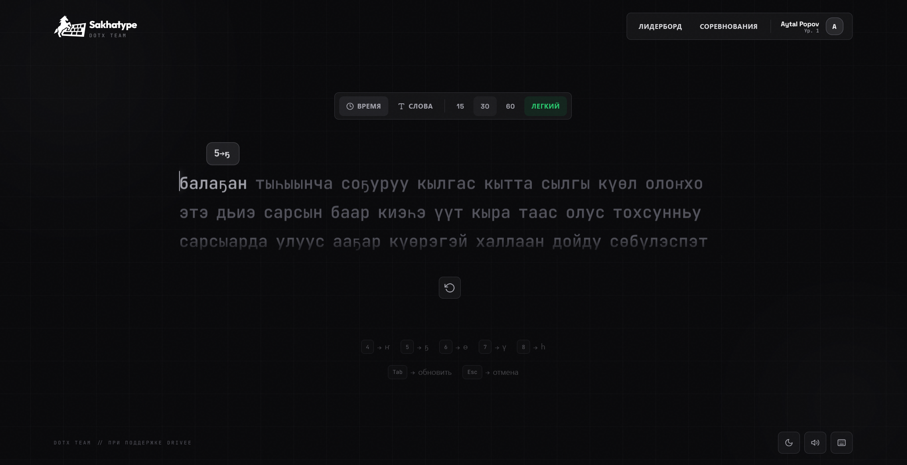

<p align="center">
  
</p>

<h1 align="center">Sakhatype — Frontend</h1>

<p align="center">
  Веб-клиент тренажёра скорости печати на <strong>якутском языке</strong>.<br />
  Репозиторий: только UI на <strong>SvelteKit</strong>; для полной работы требуется совместимый бэкенд (REST + WebSocket)
</p>

<p align="center">
  
</p>
<p align="center"><em>Главный экран: тёмная тема, режимы «время / слова», подсказки для саӄа-символов</em></p>

---

## Содержание

- [Возможности](#возможности)
- [Технологический стек](#технологический-стек)
- [Быстрый старт](#быстрый-старт)
- [Переменные окружения и прокси](#переменные-окружения-и-прокси)
- [Структура репозитория](#структура-репозитория)
- [Маршруты приложения](#маршруты-приложения)
- [Слой API](#слой-api)
- [Версия и лицензия](#версия-и-лицензия)

---

## Возможности

- Набор текста с учётом **якутской раскладки** (цифровые и пользовательские привязки клавиш)
- Режимы: **по времени** и **по количеству слов**, настройка сложности
- **Лидерборд** с фильтрацией по режиму
- **Профили** пользователей и публичные страницы
- **Арена**: комнаты и многопользовательская игра по **WebSocket**
- Темы (светлая / тёмная), звук, настройки отображения (карет, подсказки)

---

## Технологический стек

| Технология | Роль |
|------------|------|
| [SvelteKit](https://kit.svelte.dev/) 2 | Маршрутизация, сборка |
| [Svelte](https://svelte.dev/) 5 | Компоненты UI |
| [Vite](https://vitejs.dev/) 5 | Dev-сервер и бандл |
| [Tailwind CSS](https://tailwindcss.com/) 3 | Стили |
| [Skeleton](https://www.skeleton.dev/) | UI-кит и темы |
| [Lucide Svelte](https://lucide.dev/) | Иконки |
| [@floating-ui/dom](https://floating-ui.com/) | Позиционирование всплывающих элементов |

**Сборка:** [`@sveltejs/adapter-static`](https://github.com/sveltejs/kit/tree/master/packages/adapter-static) — статический вывод в каталог `build`, `fallback: 'index.html'` для SPA на статическом хостинге.

**Режим приложения:** в `src/routes/+layout.js` отключены SSR и пререндер (`ssr: false`, `prerender: false`) — клиентское SPA.

---

## Быстрый старт

**Требования:** Node.js **18+** (рекомендуется текущий LTS).

```bash
npm install
npm run dev
```

Откройте в браузере URL из вывода Vite (обычно `http://localhost:5173`).

### NPM-скрипты

| Команда | Назначение |
|---------|------------|
| `npm run dev` | Разработка с HMR |
| `npm run build` | Production-сборка в `build/` |
| `npm run preview` | Локальный просмотр собранного приложения |

---

## Переменные окружения и прокси

| Переменная | Описание |
|------------|----------|
| `VITE_API_URL` | Базовый URL API. Если не задан — используется `'/api'` (тот же хост, что и фронт). |

**Локальная разработка:** в `vite.config.js` настроен прокси:

- `http://localhost:5173/api` → `http://localhost:8000`
- WebSocket `/api/arena/ws` → `ws://localhost:8000`

Бэкенд на порту **8000** можно не указывать отдельно во фронтенд-конфиге.

**Продакшен:** задайте `VITE_API_URL` полным URL API (например `https://api.example.com`) либо настройте reverse proxy так, чтобы путь `/api` проксировался на бэкенд. URL WebSocket для арены выводится из `VITE_API_URL` (см. `src/routes/arena/+page.svelte`) или из `location.host` при относительном API

---

## Структура репозитория

```
src/
├── app.css                 # Глобальные стили, Tailwind
├── app.html                # HTML-оболочка
├── lib/
│   ├── components/
│   │   ├── layout/         # Header, Footer
│   │   ├── modals/         # Профиль, друзья, раскладка, аватар
│   │   └── typing/         # TypingArea, режимы, результат, WPM, история
│   ├── stores/
│   │   ├── user.js         # Сессия, токен, вход / регистрация / выход
│   │   ├── typing.js       # Состояние текущего теста
│   │   └── settings.js     # Режим, тема, саӄа-бинды, звук (localStorage: dotx_settings)
│   └── utils/
│       ├── api.js          # HTTP-клиент к бэкенду
│       ├── sakha.js        # Маппинг клавиш для якутских символов
│       ├── wordDifficulty.js
│       ├── sound.js
│       └── …
└── routes/
    ├── +layout.svelte      # Оболочка: шапка, тема, фон
    ├── +layout.js          # SPA без SSR/prerender
    ├── +page.svelte        # Главная: тренажёр
    ├── auth/+page.svelte   # Вход и регистрация
    ├── leaderboard/+page.svelte
    ├── arena/+page.svelte  # Комнаты, WebSocket
    └── profile/[username]/+page.svelte
```

**Алиасы** (см. `svelte.config.js`): `$lib`, `$components`, `$stores`, `$utils`.

---

## Маршруты приложения

| Маршрут | Назначение |
|---------|------------|
| `/` | Режимы набора, сложность, область ввода, результат (WPM, точность); для авторизованных — отправка результата на сервер |
| `/auth` | Регистрация и вход |
| `/leaderboard` | Таблица рекордов, фильтр по режиму |
| `/arena` | Комнаты, создание, игра по WebSocket (`/api/arena/ws/...`) |
| `/profile/[username]` | Публичный профиль |

**Настройки** (store `settings.js`): длительность и режим теста, сложность слов, якутская раскладка, кастомные привязки клавиш, тема, звук, карет, подсказки

---

## Слой API

Базовый префикс запросов: `import.meta.env.VITE_API_URL || '/api'` (реализация в `src/lib/utils/api.js`).

Основные группы методов объекта `api`:

| Область | Методы (ориентир) |
|---------|-------------------|
| Аутентификация | `register`, `login`, `getMe` |
| Набор | `getWords`, `submitResult`, `getHistory` |
| Лидерборд | `getLeaderboard` |
| Профиль | `getProfile`, `updateProfile`, `getAchievements` |
| Арена | `createRoom`, `listRooms` |

Отдельные экраны (друзья, аватар и т.д.) могут вызывать дополнительные методы — контракт должен совпадать с вашим бэкендом